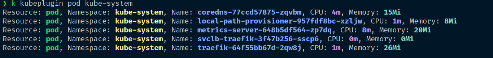

# Інструкція з користання плігіна kubeplugin 

### **✅ Інструкція**

-  :warning: Будь ласка, зверніть увагу, що для використання цього плагіна Вам потрібно мати встановлену утиліту [kubectl](https://kubernetes.io/docs/tasks/tools/) та налаштувати доступ до кластера Kubernetes.

Склонуйте репозиторій з кодом та використайте команди:

```sh
sudo chmod +x ./kubeplugin
sudo cp kubeplugin /usr/local/bin/kubectl-kubeplugin
```
Якщо встановлений `krew` можна просто створити symlink

```sh
ln -s /full_path_to_plugin/scripts/kubeplugin /path_to_localhome/.krew/bin/kubectl-kubeplugin -f 
k plugin list
``` 
Приклад виконання команди :memo:

```sh
k kubeplugin pod kube-system
```
Результати виконання `будуть виведені у форматі "Resource, Namespace, Name, CPU, Memory"` :chart_with_upwards_trend:


